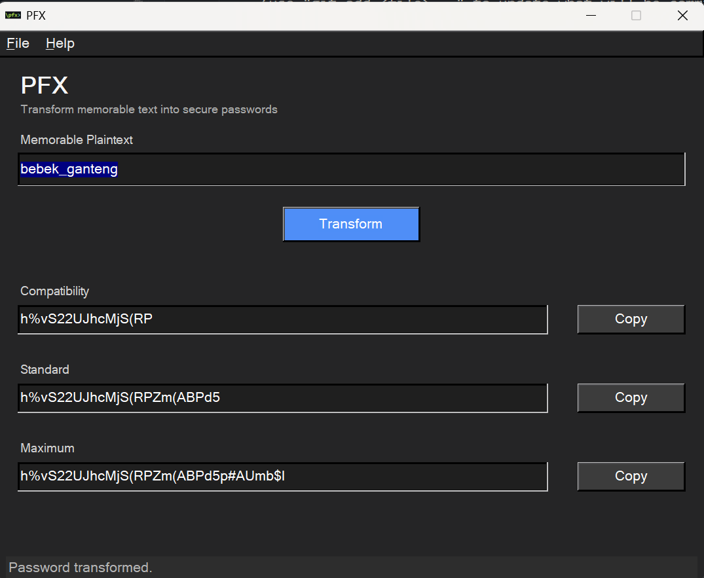

<table>
<tr>
<td align="center" width="50%">

### GUI



</td>

<td align="center" width="50%">

### Command Line


</td>
</tr>
</table>

---

# PFX

PFX is a deterministic password transformation engine written in C++.

Instead of generating random passwords, PFX transforms a memorable plaintext into a strong, deterministic password using Argon2id and a deterministic transformation pipeline.


## Features

- Deterministic password transformation
- Argon2id-based key derivation
- Three password profiles
  - Compatibility
  - Standard
  - Maximum
- Deterministic password policy repair
- Native desktop application
- Native command-line interface
- Clipboard support
- Deterministic regression testing
- Modern CMake project

```

## Build

```bash
cmake -B build
cmake --build build
```

Release build

```bash
cmake -B build-release
cmake --build build-release --config Release
```

---

## Usage

### Desktop

Run:

```text
pfx-gui.exe
```

### CLI

```bash
pfx <plaintext>
```

Example

```bash
pfx bebek_ganteng
```

Output

```text
Compatibility : ****************
Standard      : ************************
Maximum       : ********************************
```

Copy a generated password

```bash
pfx bebek_ganteng --std --copy
```

---

## Recommendation

Choose a memorable plaintext that is easy to reproduce.

Examples:

```text
github_main
github-main
my_bank_2026
laptop-login
```

Spaces are fully supported.

However, separators such as `_` and `-` are generally easier to reproduce consistently than whitespace.

---

## Documentation

- [Algorithm](docs/ALGORITHM.md)
- [Architecture](docs/ARCHITECTURE.md)

---

## Status

> Active development.

Current milestones:

- ✅ Core transformation engine
- ✅ Native CLI
- ✅ Native desktop GUI
- ✅ Clipboard support
- ✅ Regression testing

Next milestone:

- Web application

---

## Third-Party Libraries

PFX uses the following open source libraries.

- Argon2
- FLTK

---

## License

MIT License.